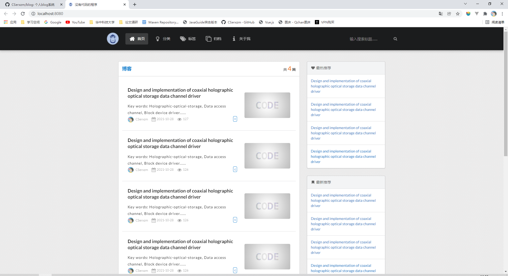
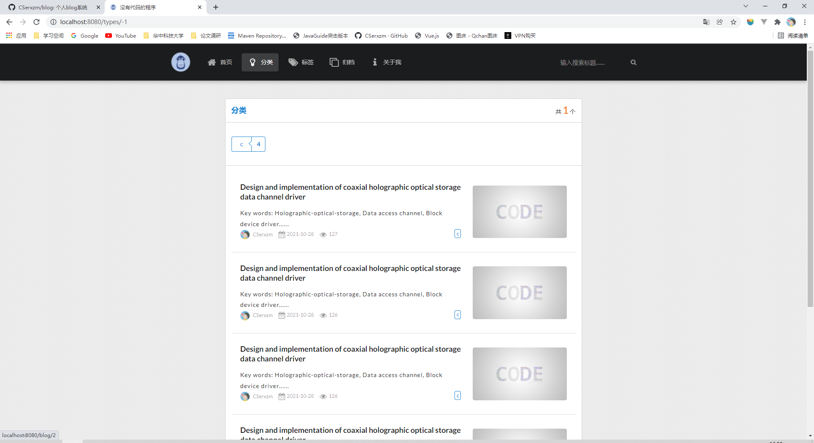
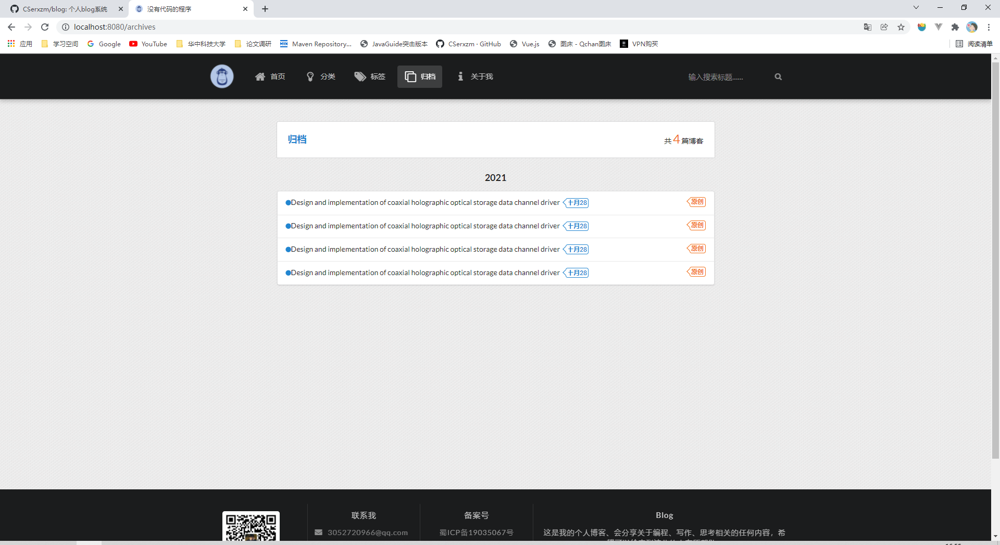
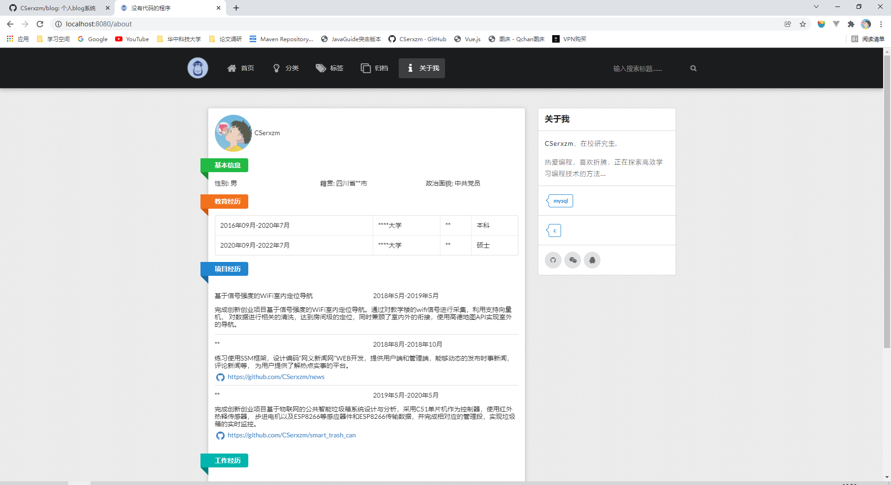
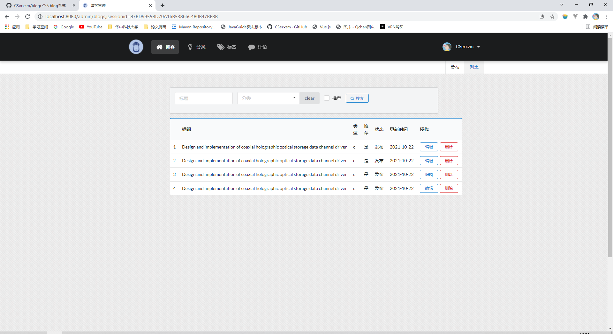
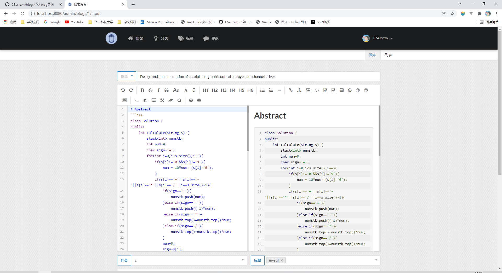
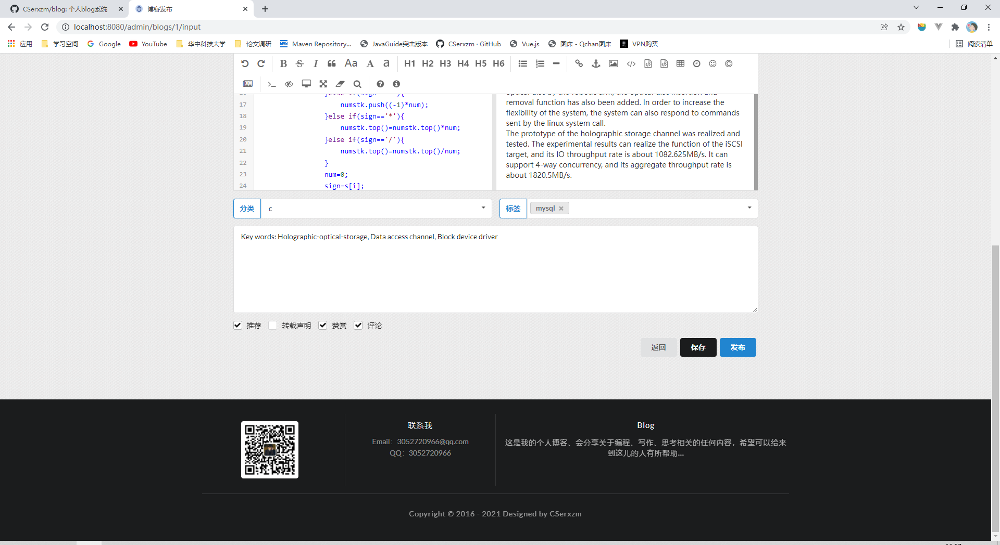
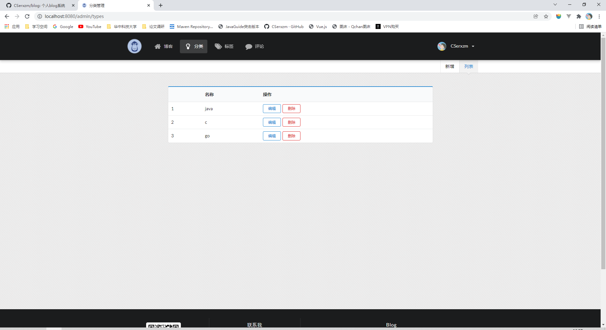

# blog
该项目实现的是blog，用于展示自己的一些文章和简历，喜欢的可以star。
## 涉及的技术环境：
#### 环境
* jdk 1.8
* IDEA 2017
* MAVEN 3.6.0
#### 技术
* semantic ui
* spring boot
* mybatis
* redis
#### 运行配置
由于application.yml中涉及太多敏感信息，文件不上传，需要自己创建，并把下面的代码复制到yml文件，变换成自己的信息，即可运行。
```java
spring:
  thymeleaf:
    mode: HTML
  datasource:
    driver-class-name: com.mysql.jdbc.Driver
    url: jdbc:mysql://127.0.0.1:3306/blog?useUnicode=true&characterEncoding=UTF-8
    username: *******
    password: *******
    type: com.alibaba.druid.pool.DruidDataSource

    initialSize: 5
    minIdle: 5
    maxActive: 20
    maxWait: 60000
    timeBetweenEvictionRunsMillis: 60000
    minEvictableIdleTimeMillis: 300000
    validationQuery: SELECT 1 FROM DUAL
    testWhileIdle: true
    testOnBorrow: false
    testOnReturn: false
    poolPreparedStatements: true
    #   配置监控统计拦截的filters，去掉后监控界面sql无法统计，'wall'用于防火墙
    filters: stat,wall,log4j
    maxPoolPreparedStatementPerConnectionSize: 20
    useGlobalDataSourceStat: true
    connectionProperties: druid.stat.mergeSql=true;druid.stat.slowSqlMillis=500

  mvc:
    static-path-pattern: /**
    resources:
      static-locations: classpath:/static/

  redis:
    host: 127.0.0.1
    port: 6379
    password: password

  mail:
    username: 3052720966@qq.com
    password: ********
    host: smtp.qq.com
    port: 465
    properties:
      mail:
        smtp:
          ssl:
            enable: true
      imap:
        ssl:
          socketFactory:
            fallback: false

mybatis:
  config-location: classpath:mybatis/mybatis-config.xml
  mapper-locations:
  - classpath:mybatis/mapper/*.xml

logging:
  level:
    com.xzm: error
  file: /log/blog.log

comment.avatar: /images/avator.png

#jasypt加密的密匙
jasypt:
  encryptor:
    password: qwertyuiopasdfgh
```
## 功能
* blog的管理，发布，如草稿的报错
* blog的赞赏，首图，以及top，hot的设置
* 评论的管理，以及评论发送到邮件
* 个人简历的展示，可根据模板自定义修改
* 对于浏览的的统计，自定义注解，实现IP的过滤，避免重复统计
## 运行截图









## 演示地址
[没有代码的程序](https://fuyuanplant.cn)

## 在线乞讨


**什么？上面没有支付宝，我信了，那么微信喃？**


## 最后的话
谢谢！